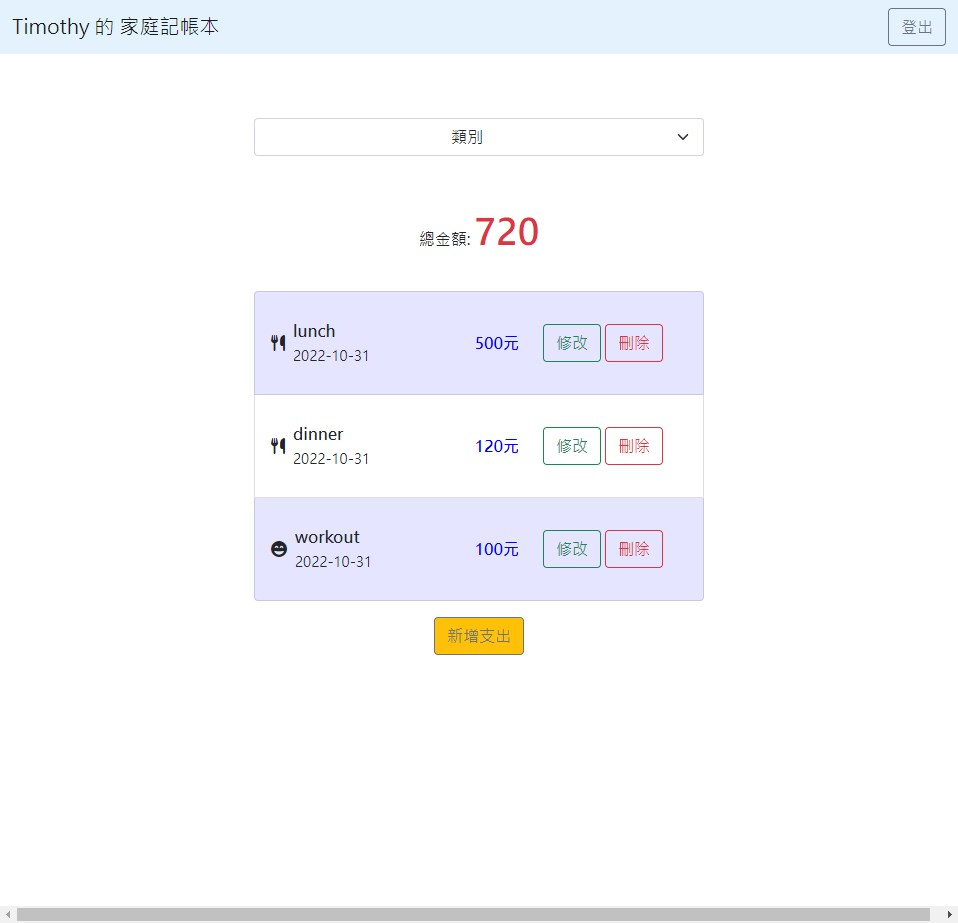

# Expense Tracker

## Introduction
A web application of expense details recorded, including name, date, category, amount, and you can check it by registering account。

## Screenshot

- Total Expenses



## Features

- Register account
- Add a expense record
- Edit a expense record detail
- Delete a expense record
- Check different categories of total expenses

## Install

1. Store this project to local

```
git clone https://github.com/Coli-co/expense_tracker.git
```

2. Switch to project folder

```
cd expense_tracker
```

3. Install npm packages required

```
npm install
```

4. Load seed data

```
npm run seed
```

5. Start project

```
npm run start
```

## Test Account

- Mail: `user1@example.com, user2@example.com`
- Password: `12345678`

## Developer

- [Timothy](https://github.com/Coli-co)
